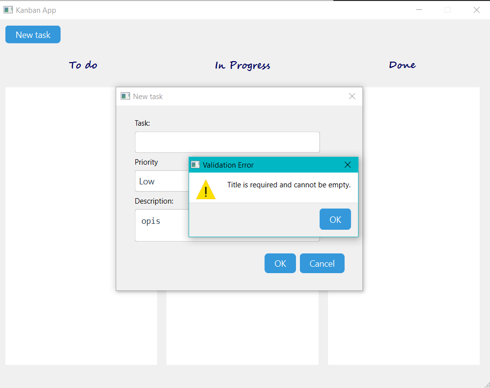
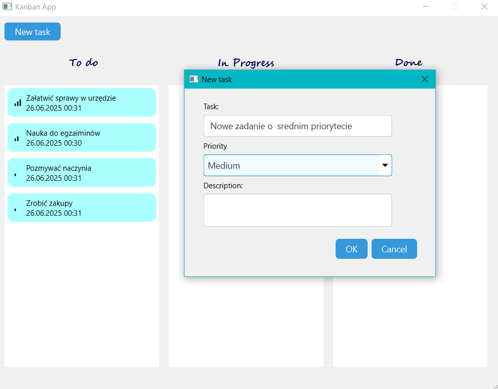
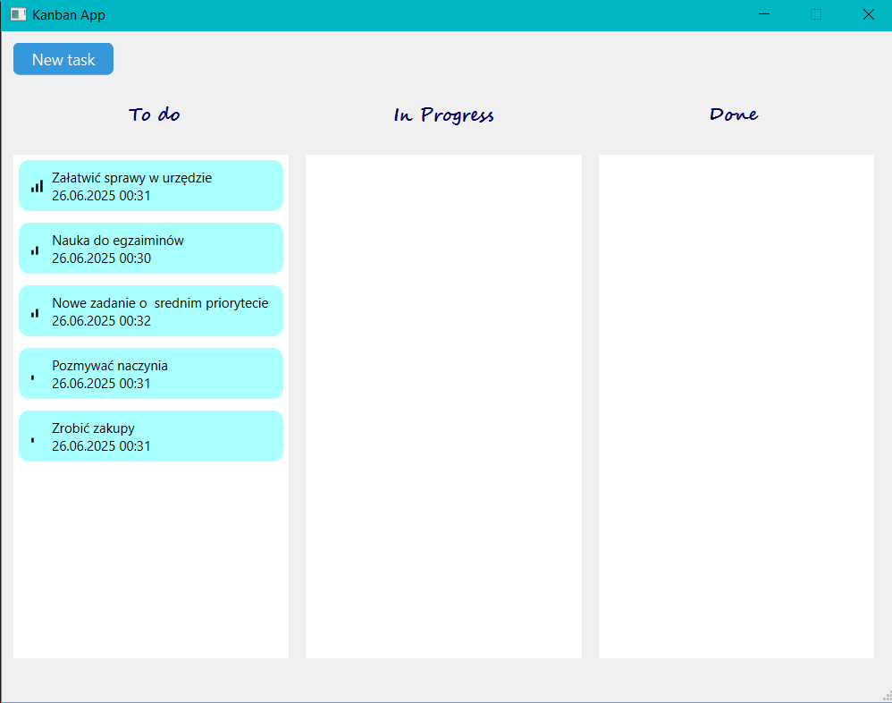
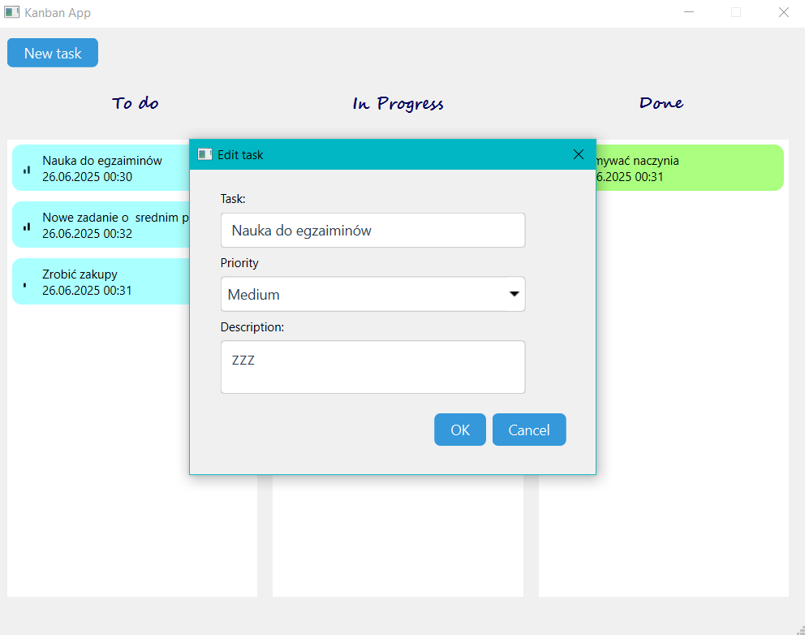
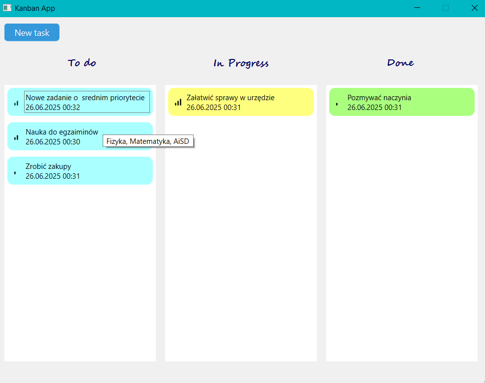
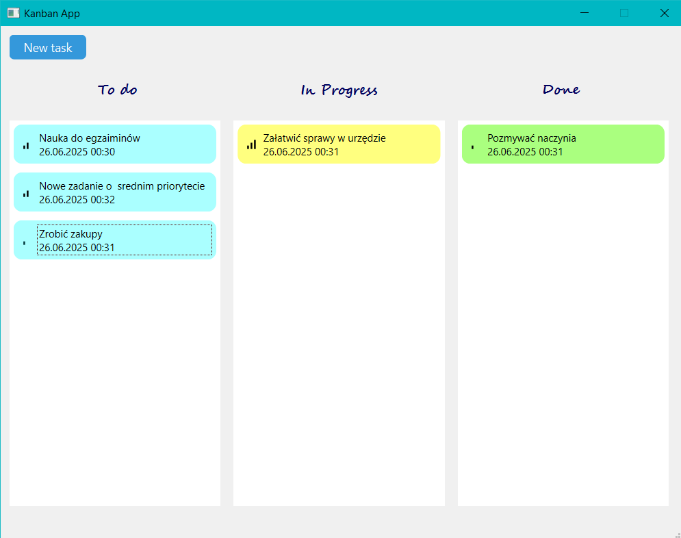
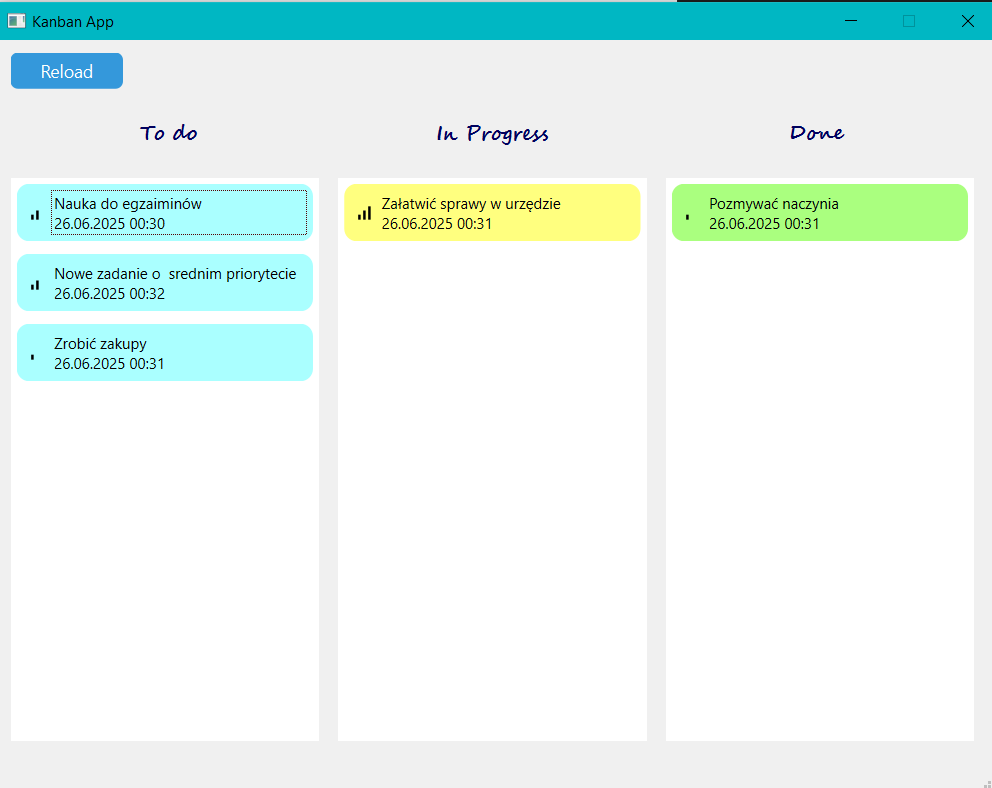
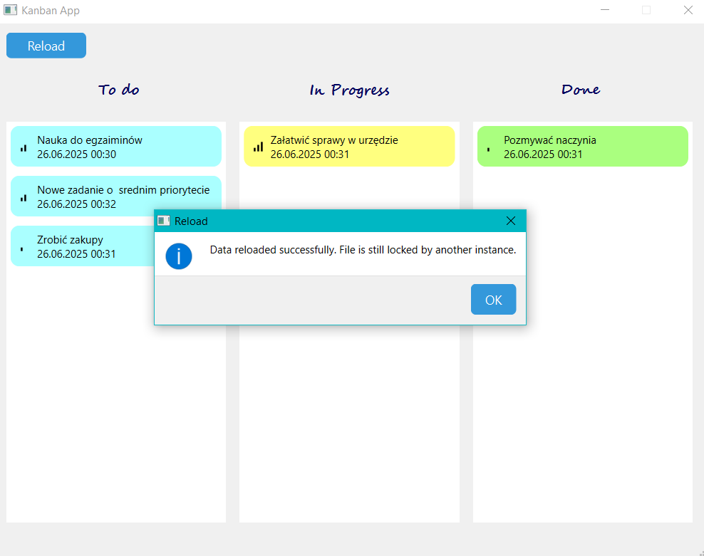
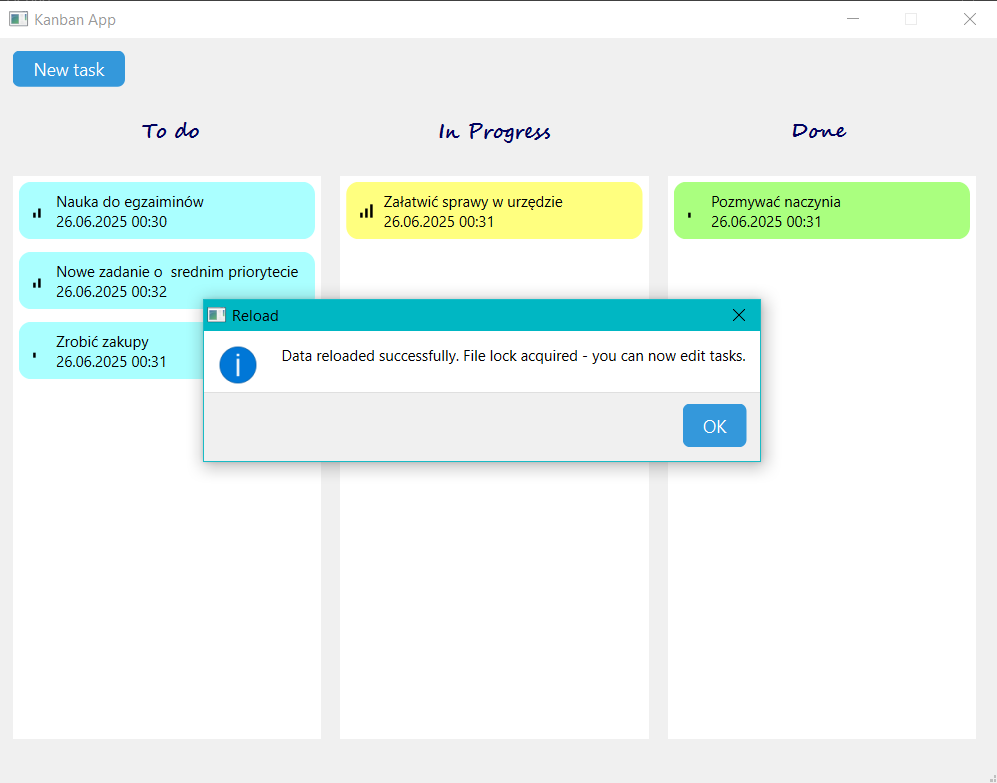

# Aplikacja Kanban - Zarządzanie Zadaniami

Aplikacja Kanban to narzędzie do zarządzania zadaniami oparte na metodologii Kanban, zbudowane w Qt/C++. Umożliwia organizację zadań w trzech kolumnach: Do zrobienia, W trakcie i Zakończone.

## Funkcje aplikacji

### 1. Tworzenie nowych zadań

**Opis:** Dodawanie nowych zadań z tytułem, opisem i priorytetem.

**Instrukcja użytkowania:**

- Kliknij przycisk "Dodaj zadanie"
- Wypełnij formularz:
  - **Tytuł** - krótka nazwa zadania (wymagane)
  - **Opis** - szczegółowy opis zadania (opcjonalne)
  - **Priorytet** - Niski/Średni/Wysoki
- Kliknij "OK" aby utworzyć zadanie





### 2. Edycja istniejących zadań

**Opis:** Modyfikowanie tytułu, opisu i priorytetu istniejących zadań.

**Instrukcja użytkowania:**

- Kliknij prawym przyciskiem myszy na zadanie
- Wybierz "Edytuj" z menu kontekstowego
- Zmodyfikuj dane w formularzu
- Kliknij "OK" aby zapisać zmiany





### 3. Usuwanie zadań

**Opis:** Całkowite usunięcie zadania z systemu.

**Instrukcja użytkowania:**

- Kliknij prawym przyciskiem myszy na zadanie
- Wybierz "Usuń" z menu kontekstowego
- Zadanie zostanie natychmiast usunięte

### 4. Przenoszenie zadań między kolumnami (Drag & Drop)

**Opis:** Zmiana statusu zadania poprzez przeciągnięcie między kolumnami.

**Instrukcja użytkowania:**

- Kliknij i przytrzymaj zadanie
- Przeciągnij do docelowej kolumny:
  - **Do zrobienia** - zadania zaplanowane
  - **W trakcie** - zadania w realizacji
  - **Zakończone** - zadania ukończone
- Puść przycisk myszy aby upuścić zadanie



### 5. Automatyczne sortowanie według priorytetu

**Opis:** Zadania są automatycznie sortowane według priorytetu (Wysoki → Średni → Niski).

**Instrukcja użytkowania:**

- Sortowanie odbywa się automatycznie
- Nowe zadania są wstawiane w odpowiednie miejsce
- Ikony priorytetów ułatwiają rozpoznanie ważności

### 6. Wyświetlanie tooltipów

**Opis:** Podgląd pełnych informacji o zadaniu po najechaniu myszą.

**Instrukcja użytkowania:**

- Najedź myszą na zadanie
- Zostanie wyświetlony tooltip z:
  - Tytułem zadania (jeśli brak opisu)
  - Opisem zadania (jeśli istnieje)

### 7. Zapis i odczyt z pliku

**Opis:** Automatyczne zapisywanie i wczytywanie zadań z pliku JSON.

**Instrukcja użytkowania:**

- Dane są automatycznie zapisywane po każdej zmianie
- Przy uruchomieniu aplikacji dane są wczytywane z pliku `kanban.json`
- Nie ma potrzeby ręcznego zapisywania

### 8. Tryb tylko do odczytu i blokada pliku

**Opis:** Ochrona przed jednoczesną edycją przez wielu użytkowników.

**Instrukcja użytkowania:**

- Jeśli inny użytkownik edytuje plik, aplikacja przechodzi w tryb tylko do odczytu
- W trybie tylko do odczytu:
  - Nie można przeciągać zadań
  - Przycisk "Dodaj zadanie" jest zastąpiony przyciskiem "Odśwież"
  - Menu kontekstowe jest wyłączone
- Kliknij "Odśwież" aby sprawdzić czy plik jest nadal zablokowany



## Szczegóły implementacji

### Techniki programowania obiektowego

**Dziedziczenie klas i nadpisywanie metod:**
Aplikacja wykorzystuje techniki programowania obiektowego:

- **Dziedziczenie z Qt:** Wszystkie główne klasy dziedziczą z odpowiednich klas Qt:

  - `MainWindow : public QMainWindow` - główne okno aplikacji
  - `KanbanController : public QObject` - kontroler z systemem sygnałów/slotów
  - `KanbanListWidget : public QListWidget` - niestandardowy widget listy
  - `CreateForm/EditForm : public QDialog` - formularze dialogowe

- **Nadpisywanie metod wirtualnych:** Klasy nadpisują metody bazowe dla dostosowania zachowania:
  - `KanbanListWidget` nadpisuje metody drag & drop (`dragEnterEvent`, `dropEvent`)
  - Formularze mogą nadpisywać `accept()`, `reject()` dla walidacji

**Przykład dziedziczenia w KanbanListWidget:**

```cpp
class KanbanListWidget : public QListWidget
{
    Q_OBJECT

public:
    explicit KanbanListWidget(QWidget *parent = nullptr);
    void setStatus(Status status);

protected:
    // Nadpisanie metod drag & drop z QListWidget
    void dragEnterEvent(QDragEnterEvent *event) override;
    void dropEvent(QDropEvent *event) override;
    void startDrag(Qt::DropActions supportedActions) override;

signals:
    void taskDropped(const QUuid &id, Status newStatus);

private:
    Status listStatus;
};
```

### Zarządzanie danymi

**Format pliku JSON:**

```json
[
	{
		"id": "{12345678-1234-5678-9abc-123456789abc}",
		"title": "Zadanie przykładowe",
		"description": "Opis zadania",
		"status": 0,
		"priority": 2,
		"createdAt": "2025-06-25T10:30:00.000Z"
	}
]
```

**Automatyczne zapisywanie:**

- Każda operacja modyfikująca dane wywołuje `saveToFile()`
- Brak potrzeby ręcznego zapisywania
- Zabezpieczenie przed utratą danych

### Bezpieczeństwo

**Blokada pliku:**

- Tworzenie pliku `.lock` przy otwarciu
- Sprawdzanie istnienia blokady przed edycją
- Automatyczne czyszczenie blokady przy zamknięciu

### Testowanie blokady pliku

Aby przetestować funkcję blokady pliku:

Jeżeli masz możliwość uruchomienia 2 instancji aplikacji działających jednocześnie w tej samej lokalizacji:

1. Uruchom pierwszą instancję aplikacji
2. Uruchom drugą instancję - powinna uruchomić się w trybie tylko do odczytu
3. Zamknij pierwszą instancję
4. W drugiej instancji kliknij "Odśwież" - powinna odzyskać możliwość edycji

W przeciwnym wypadku:

1. Do lokalizacji aplikacji (tam gdzie znajdziesz plik kanban.json - jeżeli uruchamiasz z poziomy IDE, będzie to wewnątrz folderu debug/release) dodaj plik kanban.json.lock
2. Uruchom aplikację - powinna uruchomić się w trybie tylko do odczytu
3. Usuń plik kanban.json.lock
4. Kliknij "Odśwież" - aplikacja powinna odzyskać możliwość edycji



